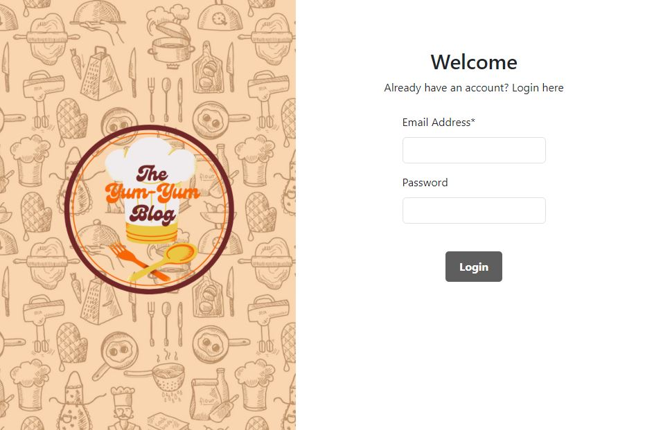
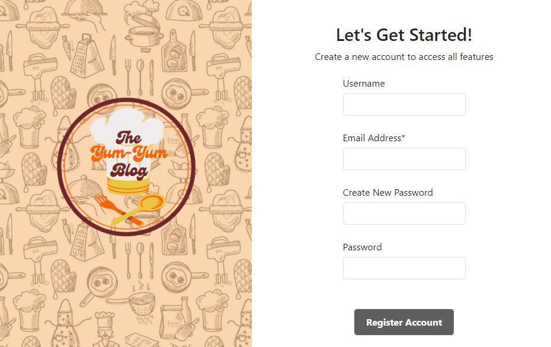

# The Yum Yum Blog

## Description
The Yum Yum Blog is a recipe blog. Any user can search for recipes and a registered user can also favorite (save) recipes to view later.

This application is run on Node and uses MySQL as a database. It is deployed at: 

Future development:
- User can rate recipes
- User can add comments to recipes
- User can add their own recipes

We used Spoonacular API to pull recipes.

Login

Signup

    
## Table of Contents 
    
- [Installation](#installation)
- [Usage](#usage)
- [Credits](#credits)
- [Tests](#tests)
- [Questions](#questions)
- [License](#license)

    
## Installation
- Node v16
- MySQL
    
## Usage
This application is deployed to Heroku at 

To use this application locally, you must:
1. Download this repositiory to your local machine.
2. In the terminal, launch mysql by typing:

        mysql -u root -p
3. Enter your local password.
4. Input the following:

        source db/schema.sql
5. Open a new terminal and download the dependencies by typing: 

        npm i  
6. Seed the database by typing:

        npm run seed
7. Create a copy of the .env.EXAMPLE file, rename it to .env, and add your mysql user and password.
8. To run the app, type:

        npm start
9. Open the specified port on your web application of choice.

 
## Credits
This application was built by Callistus Nguyen, Claire Alverson, and Marissa Fonseca. 

## Tests
N/A

## License
This project is covered under the MIT License.